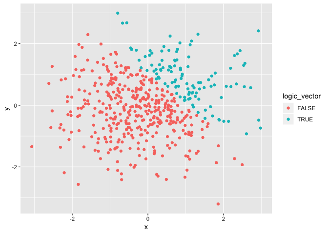

p8105\_hw1\_ob2305
================
Olya Besedina
2019-09-18

# Problem 1

``` r
my_df = tibble(
  vec_numeric = rnorm(8),
  vec_logical = vec_numeric > 0,
  vec_char = c("monkey", "eel", "finch", "dog", "cat", "salmon", "carp","parrot"),
  vec_factor = factor(c("mammal", "fish", "bird", "mammal", "mammal", "fish", "fish", "bird"))
)

# The mean of the variables inside the data frame
mean(pull(my_df, vec_numeric))
```

    ## [1] -0.04593056

``` r
mean(pull(my_df, vec_logical))
```

    ## [1] 0.25

``` r
mean(pull(my_df, vec_char))
```

    ## Warning in mean.default(pull(my_df, vec_char)): argument is not numeric or
    ## logical: returning NA

    ## [1] NA

``` r
mean(pull(my_df, vec_factor))
```

    ## Warning in mean.default(pull(my_df, vec_factor)): argument is not numeric
    ## or logical: returning NA

    ## [1] NA

``` r
# You can only take a mean of numeric or logical vectors, thus mean(vec_char) and mean(vec_factor) are not applicable.

## Application of as.numeric

# logical vector
l = pull(my_df, vec_logical)
as.numeric(l)
```

    ## [1] 0 1 1 0 0 0 0 0

``` r
# character vector
c = pull(my_df, vec_char)
as.numeric(c)
```

    ## Warning: NAs introduced by coercion

    ## [1] NA NA NA NA NA NA NA NA

``` r
# You cannot apply as.numeric function to a character vector. This explains why you cannot take a mean of words. 

# factor vector
f = pull(my_df, vec_factor)
as.numeric(f)
```

    ## [1] 3 2 1 3 3 2 2 1

``` r
# Factor vector has 3 levels and thus can be expressed as a number. 
```

## Second code chunk

Convert logical vector to numeric and multiply result by the random
sample

``` r
l = pull(my_df, vec_logical)
l_1 = as.numeric(l)
pull(my_df,vec_numeric)*l_1
```

Convert the logical vector to a factor and multiply teh random sample by
the result

``` r
l_2 = pull(my_df, vec_logical)
l_3 = as.factor(l_2)
pull(my_df,vec_numeric)*l_3
```

Convert logical vector to a factor and then convert the result to
numeric and multiply random sample by the result

``` r
l_2 = pull(my_df, vec_logical)
l_3 = as.factor(l_2)
l_4 = as.numeric(l_3)
pull(my_df,vec_numeric)*l_4
```

# Problem 2

``` r
plot_df = tibble(
  x = rnorm(500),
  y = rnorm(500),
  logic_vector = (x + y) >1,
  numeric_vector = as.numeric(logic_vector),
  factor_vector = as.factor(logic_vector)
)

df_rows = nrow(plot_df)
df_col = ncol(plot_df)
x_mean = mean(pull(plot_df, x))
x_median = median(pull(plot_df, x))
x_sd = sd(pull(plot_df, x))
lv = pull(plot_df, logic_vector)
```

My data frame has 500 rows, 5 columns. The mean of x is equal to -0.054,
median = -0.063 and standard deviation = 1.084. The proportion of cases
for which (x+y) \> 1 is equal to 112.

Here are the scatter plots

``` r
#  scatter plot of x and y
ggplot(plot_df, aes(x = x, y = y,  color = logic_vector)) + geom_point()
```

<!-- -->

``` r
ggsave("scatterplot.pdf")
```

    ## Saving 7 x 5 in image

Scatter plot has two colors representing true and false values for
logical vector x+y \> 1; values which are \>1 represented by the teal
color, while values which are \<1 represented by the red color.

``` r
# scatter plot for numeric variable 
ggplot(plot_df, aes(x = x, y = y,  color = numeric_vector)) + geom_point()
```

<!-- -->

Scatter plot has two colors representing values for a numeric factor;
values which are \>1 represented by the light blue color, while values
which are \<1 represented by the navy color.

``` r
# scatter plot for factor variable 
ggplot(plot_df, aes(x = x, y = y,  color = factor_vector)) + geom_point()
```

<!-- -->

Scatter plot has two colors representing true and false values for
factor variable; values which are \>1 represented by the teal color,
while values which are \<1 represented by the red color.
